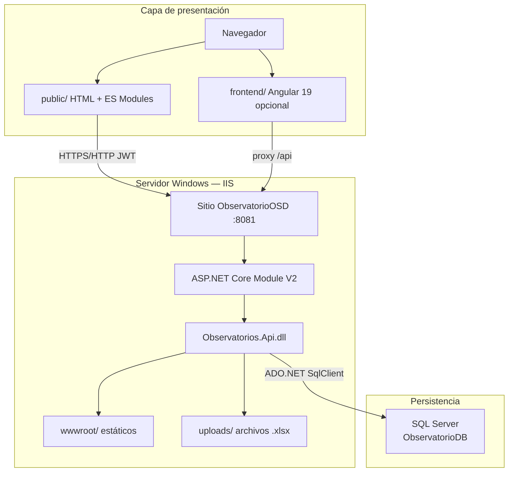
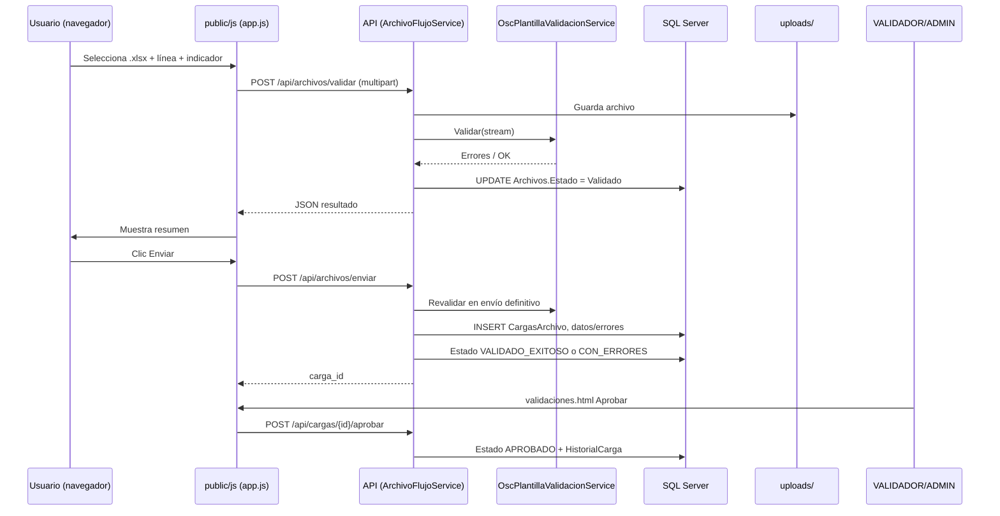

# Arquitectura técnica — Observatorio de Salud Departamental (OSD)

**Proyecto:** Observatorios Salud Departamental Casanare  
**Repositorio:** [nestorm94/SEC_Salud_OSD](https://github.com/nestorm94/SEC_Salud_OSD)  
**Versión del documento:** 1.0 — mayo 2026

---

## Tabla de contenidos

1. [Descripción general](#1-descripción-general)
2. [Vista de arquitectura](#2-vista-de-arquitectura)
3. [Frontend](#3-frontend)
4. [Backend](#4-backend)
5. [Base de datos](#5-base-de-datos)
6. [Despliegue en IIS](#6-despliegue-en-iis)
7. [Flujo de comunicación entre capas](#7-flujo-de-comunicación-entre-capas)
8. [Tecnologías utilizadas](#8-tecnologías-utilizadas)
9. [Paquetes y dependencias](#9-paquetes-y-dependencias)
10. [Configuración de ambientes](#10-configuración-de-ambientes)
11. [Puertos configurados](#11-puertos-configurados)
12. [Estructura de carpetas](#12-estructura-de-carpetas)
13. [Archivos de configuración](#13-archivos-de-configuración)
14. [Seguridad y roles](#14-seguridad-y-roles)
15. [Flujo funcional de cargue Excel (OSC)](#15-flujo-funcional-de-cargue-excel-osc)

---

## 1. Descripción general

La solución **Observatorio OSD** es una plataforma web para la **Gobernación de Casanare / Secretaría de Salud** que permite:

- Autenticación por usuario, dependencia y roles.
- **Carga y validación** de archivos Excel según plantilla oficial **OSC V.2** (hojas `Diccionario_datos` y `DATA`).
- Flujo en dos pasos: **Validar** → **Enviar** → **Aprobar/Rechazar** (validadores y administradores).
- Administración de usuarios, líneas temáticas, indicadores, áreas y plantillas.
- Consulta de **proyección de población** mediante vistas SQL.
- Trazabilidad en historial de cargues y auditoría del sistema.

La arquitectura es **monolito hospedado**: una única aplicación ASP.NET Core sirve la **API REST** y el **frontend estático** (`public/`), con persistencia en **SQL Server** y archivos físicos en disco (`uploads/`).

Existe un cliente **Angular** en `frontend/` en migración; el entorno operativo actual en IIS usa el portal HTML en `public/`.

---

## 2. Vista de arquitectura



| Capa | Responsabilidad |
|------|-----------------|
| Presentación | UI, token JWT en `localStorage`, llamadas `fetch` a `/api/*` |
| Aplicación | Endpoints minimal API, servicios de negocio, validación Excel |
| Datos | Repositorios SQL, esquema idempotente al inicio |
| Archivos | Excel subidos en `uploads/` referenciados por `dbo.Archivos` |

---

## 3. Frontend

### 3.1 Portal principal (producción IIS)

Ubicación: **`public/`**. Tecnología: **HTML5 + CSS + JavaScript (ES Modules)**, sin bundler en despliegue.

| Página | Ruta | Función |
|--------|------|---------|
| Login | `/login.html` | Autenticación JWT |
| Panel | `/dashboard.html` | Resumen y navegación por rol |
| Carga Excel | `/index.html` | Subir, validar y enviar plantilla OSC |
| Historial | `/cargas.html` | Listado de cargues, errores, historial |
| Validaciones | `/validaciones.html` | Aprobar/rechazar (ADMIN / VALIDADOR) |
| Proyección población | `/proyeccion-poblacion.html` | Consulta de vistas demográficas |
| Administración | `/admin/*.html` | Usuarios, roles, líneas, indicadores, áreas, plantillas |

**Módulos JavaScript relevantes:**

| Archivo | Rol |
|---------|-----|
| `js/config.js` | Resolución de URL base de la API según puerto/origen |
| `js/auth.js` | Token, roles, sesión |
| `js/fetchJson.js` | Cliente HTTP con cabecera `Authorization` |
| `js/portal/layout.js` | Sidebar unificado, `initPortal()`, permisos UI |
| `js/portal/modal.js` | Diálogos de confirmación y formulario (estilo portal) |
| `js/app.js` | Flujo Carga Excel (validar / enviar) |
| `js/validaciones.js` | Pendientes de aprobación y enviar-y-aprobar |
| `js/cargas.js` | Historial de cargues |
| `js/fechas.js` | Formato de fechas (zona Colombia) |

**Estilos:** `css/estilos.css`, `css/portal.css`, `css/responsive.css`.

### 3.2 Cliente Angular (alternativo / desarrollo)

Ubicación: **`frontend/`**. **Angular 19**, TypeScript 5.7, RxJS 7.8.

- Arranque: `npm start` → **http://localhost:4200**
- API: `environment.apiUrl = '/api'` con proxy al backend en desarrollo.
- Módulos: login, dashboard, archivos, validaciones, administración, población.

En producción actual, el sitio IIS no depende del build de Angular; el contenido servido es `public/` copiado a `wwwroot/`.

### 3.3 Autenticación en el cliente

1. `POST /api/auth/login` → respuesta con `token` y datos de usuario.
2. Token almacenado en `localStorage` (clave gestionada en `auth.js`).
3. Peticiones posteriores: `Authorization: Bearer <token>`.
4. `GET /api/auth/me` para refrescar perfil y roles.

---

## 4. Backend

### 4.1 Proyecto

| Propiedad | Valor |
|-----------|--------|
| Proyecto | `backend/Observatorios.Api/Observatorios.Api.csproj` |
| Framework | **.NET 10** (`net10.0`) |
| Estilo API | **ASP.NET Core Minimal API** |
| Hosting | Kestrel (desarrollo) / IIS in-process (producción) |

### 4.2 Capas internas

```
Program.cs                 → arranque, wwwroot, uploads, seed, middleware
Endpoints/
  ApiEndpoints.cs          → rutas /api (auth, archivos, cargas, proyección)
  AdminEndpoints.cs        → rutas /api/admin/*
Auth/
  AuthExtensions.cs        → JWT Bearer, política Administrador
  UserContext.cs             → claims, permisos por rol/dependencia/línea
Data/
  *Repository.cs           → acceso SQL Server (ADO.NET)
  ObservatorioDbSchema.cs  → DDL idempotente al inicio
Services/
  AuthService.cs
  AuthorizationService.cs
  ArchivoFlujoService.cs     → validar / enviar / enviar-y-aprobar
  ArchivoPrevalidacionService.cs
  OscPlantillaValidacionService.cs  → motor OSC V.2
  CargaArchivoService.cs     → procesamiento definitivo y aprobación
  ExcelValidationService.cs  → validación legacy
  DiccionarioOscV2Reader.cs
  *SeedService.cs
Models/
  CargaEstados.cs, ArchivoEstados.cs, RolNombres.cs
```

### 4.3 Servicios de validación Excel

| Servicio | Uso |
|----------|-----|
| `OscPlantillaValidacionService` | Plantilla oficial OSC V.2: hojas `Diccionario_datos` + `DATA`, tipos, dominios, DIVIPOLA, duplicados por clave compuesta |
| `ArchivoPrevalidacionService` | Prevalidación al subir (antes de envío definitivo) |
| `ExcelValidationService` | Formato simplificado legacy (`Diccionario_Datos` / `Datos`) |
| `DiccionarioOscV2Reader` | Lectura y normalización de columnas del diccionario |

### 4.4 Endpoints principales (agrupación)

| Grupo | Prefijo | Autenticación |
|-------|---------|---------------|
| Salud | `GET /api/ping`, `GET /api/salud` | Pública |
| Auth | `POST /api/auth/login`, `GET /api/auth/me` | Login público |
| Archivos | `POST /api/archivos/validar`, `enviar`, `GET /api/archivos` | JWT |
| Cargas | `GET/POST /api/cargas/*`, `aprobar`, `rechazar` | JWT |
| Admin | `/api/admin/*` | JWT + rol ADMIN |
| Proyección | `GET /api/proyeccion-poblacion/*` | JWT |

### 4.5 Middleware y comportamiento transversal

- **CORS:** política permisiva por defecto (desarrollo).
- **JWT:** validación en rutas bajo `RequireAuthorization()`.
- **Excepciones:** `UseExceptionHandler` devuelve JSON `{ error, tipo }`.
- **Estáticos:** `UseDefaultFiles` + `UseStaticFiles` desde `wwwroot` o `public/`.
- **UTF-8:** tipos MIME explícitos para `.html`, `.css`, `.js`.
- **Arranque:** `ObservatorioDbSchema.EnsureAllAsync()`, seeds de líneas, usuarios prueba y áreas temáticas.

### 4.6 Almacenamiento de archivos

- Directorio: **`{repoRoot}/uploads/`**
- En IIS: **`C:\Hosting\ObservatorioOSD\uploads\`**
- La publicación con `robocopy /MIR` **excluye** `uploads` para no borrar cargas de usuarios.
- Metadatos en `dbo.Archivos` (`RutaRelativa`, `NombreOriginal`, estado, línea, indicador).

---

## 5. Base de datos

### 5.1 Motor y bases

| Ambiente | Servidor (ejemplo) | Base de datos |
|----------|-------------------|---------------|
| Desarrollo (`appsettings.json`) | `(localdb)\MSSQLLocalDB` | `ObservatorioDB` |
| Producción IIS (`appsettings.Production.json`) | `localhost\SQLEXPRESS2025` | `ObservatorioDB` |

> **Importante:** Desarrollo y producción pueden apuntar a instancias distintas. Scripts de mantenimiento deben ejecutarse contra la instancia que usa IIS.

### 5.2 Modelo de datos (tablas principales)

**Seguridad y organización**

| Tabla | Propósito |
|-------|-----------|
| `Dependencias` | Entidades territoriales / secretarías |
| `Usuarios`, `UsuarioRol`, `Roles` | Cuentas, BCrypt, roles |
| `UsuarioAreaTematica` | Áreas asignadas por usuario |
| `LineaTematica`, `Indicador` | Clasificación temática de cargues |
| `AreaTematica`, `ResponsableTematico` | Modelo v2 por dependencia |

**Cargue y validación**

| Tabla | Propósito |
|-------|-----------|
| `Archivos` | Archivo físico, estado (`Validado`, `Enviado`, …), línea, indicador |
| `CargasArchivo` | Instancia de cargue, estado, fechas |
| `DiccionarioArchivo`, `CamposDiccionario` | Metadatos del diccionario persistidos |
| `DatosCargados` | Filas DATA en JSON |
| `ErroresValidacion` | Errores por fila/columna |
| `HistorialCarga` | Eventos (INICIO, APROBADO, RECHAZADO, …) |
| `ArchivoCarga`, `ValidacionArchivo` | Integración modelo áreas/plantillas v2 |

**Catálogos y consulta**

| Tabla | Propósito |
|-------|-----------|
| `dim_departamentos`, `dim_municipios` | DIVIPOLA para validación |
| `PlantillaCarga`, `PlantillaCampo`, `PlantillasCarga` | Definición de plantillas |
| `AuditoriaSistema` | Registro de acciones administrativas |

**Eliminación en cascada:** hijos de `CargasArchivo` (`ErroresValidacion`, `DatosCargados`, `HistorialCarga`, etc.) se borran al eliminar el cargue.

### 5.3 Estados

**Archivo (`ArchivoEstados`):** `PendienteValidacion` → `Validado` | `Rechazado` → `Enviado`

**Cargue (`CargaEstados`):**

| Constante | Significado |
|-----------|-------------|
| `RECIBIDO` | Cargue creado |
| `EN_VALIDACION` | Procesando Excel |
| `VALIDADO_EXITOSO` | Sin errores; pendiente de aprobación |
| `VALIDADO_CON_ERRORES` | Con errores de validación |
| `APROBADO` | Aprobado por validador/admin |
| `RECHAZADO` | Rechazado |
| `CARGADO_BD` | Cargado a BD operacional (evolución) |

Alias normalizados: `VALIDADO_OK` → `VALIDADO_EXITOSO`, `SUBIDO` → `RECIBIDO`.

### 5.4 Migración de esquema

- **Runtime:** `ObservatorioDbSchema.cs` (idempotente al iniciar la API).
- **Scripts de referencia:** `scripts/schema-completo-areas-tematicas.sql`, `scripts/schema-seguridad-cargas.sql`, `scripts/schema-lineas-tematicas-indicadores.sql`.
- **Limpieza de pruebas (manual):** `scripts/limpiar-cargues-y-archivos.sql`.

---

## 6. Despliegue en IIS

### 6.1 Topología

| Componente | Nombre / ruta |
|------------|----------------|
| Sitio IIS | `ObservatorioOSD` |
| Application Pool | `ObservatorioOSDPool` |
| Puerto HTTP | **8081** |
| Ruta física | `C:\Hosting\ObservatorioOSD` |
| Binarios API | Raíz del sitio (`Observatorios.Api.dll`) |
| Estáticos | `C:\Hosting\ObservatorioOSD\wwwroot\` |
| Uploads | `C:\Hosting\ObservatorioOSD\uploads\` |
| Logs stdout | `C:\Hosting\ObservatorioOSD\logs\` |

### 6.2 Proceso de publicación

Script: **`scripts/publicar-iis.ps1`**

1. `dotnet publish` en Release a carpeta temporal.
2. `app_offline.htm` para liberar DLLs.
3. `robocopy` API → destino (`/XD uploads` para preservar archivos subidos).
4. `robocopy` `public/` → `wwwroot/`.
5. `scripts/reciclar-sitio-iis.ps1` reinicia el App Pool.

### 6.3 Configuración IIS (`web.config`)

- Handler **AspNetCoreModuleV2**, hosting **inprocess**.
- Variable de entorno: `ASPNETCORE_ENVIRONMENT=Production`.
- Tipos MIME UTF-8 para HTML, CSS y JS.
- `stdoutLogEnabled=true` para diagnóstico.

### 6.4 URLs de verificación

- Portal: `http://localhost:8081/login.html`
- API: `http://localhost:8081/api/ping`
- Carga: `http://localhost:8081/index.html`

---

## 7. Flujo de comunicación entre capas

### 7.1 Secuencia típica (cargue OSC)



### 7.2 Capas de la petición HTTP

1. **IIS** recibe la petición en el puerto 8081.
2. Si la ruta es `/api/*`, **ANCM** delega a **Kestrel** (mismo proceso).
3. **Middleware:** CORS → excepciones → autenticación JWT → autorización.
4. **Endpoint** invoca **repositorio** y/o **servicio**.
5. Respuesta **JSON** UTF-8 al navegador.
6. Si la ruta no es API, **archivos estáticos** desde `wwwroot`.

### 7.3 Resolución de URL de API (cliente)

`public/js/config.js` determina el origen:

- Mismo origen en puertos `5289`, `5290`, `7236`, `8081` → API relativa al origen actual.
- Live Server u otros puertos → redirige a `http://localhost:5289`.
- Override: `localStorage.observatorios.apiOrigen` o `<meta name="observatorios-api-base">`.

---

## 8. Tecnologías utilizadas

| Área | Tecnología |
|------|------------|
| Runtime backend | .NET 10, ASP.NET Core |
| API | Minimal API, JWT Bearer |
| Datos | Microsoft.Data.SqlClient, SQL Server |
| Excel | ClosedXML |
| Contraseñas | BCrypt.Net-Next |
| Frontend activo | HTML5, CSS3, ES2020 Modules |
| Frontend alternativo | Angular 19, TypeScript 5.7 |
| Servidor | IIS 10+ con ASP.NET Core Hosting Bundle |
| SO objetivo | Windows Server / Windows 10+ |

---

## 9. Paquetes y dependencias

### 9.1 Backend (`Observatorios.Api.csproj`)

| Paquete NuGet | Versión | Uso |
|---------------|---------|-----|
| `BCrypt.Net-Next` | 4.0.3 | Hash de contraseñas |
| `ClosedXML` | 0.104.2 | Lectura/escritura Excel |
| `Microsoft.AspNetCore.Authentication.JwtBearer` | 9.0.4 | Autenticación JWT |
| `Microsoft.Data.SqlClient` | 6.0.2 | SQL Server |
| `System.IdentityModel.Tokens.Jwt` | 8.3.0 | Emisión/validación de tokens |

### 9.2 Frontend Angular (`frontend/package.json`)

| Paquete | Versión |
|---------|---------|
| `@angular/*` | ^19.2.0 |
| `rxjs` | ~7.8.0 |
| `typescript` | ~5.7.2 |
| `@angular/cli` | ^19.2.26 (dev) |

### 9.3 Portal estático

Sin `package.json` en `public/`; depende solo del navegador y de la API.

### 9.4 Infraestructura

- **IIS:** ASP.NET Core Module V2 (instalado con Hosting Bundle).
- **SQL Server:** LocalDB, Express o instancia institucional.
- **PowerShell:** scripts de publicación y reciclado.

---

## 10. Configuración de ambientes

| Variable ASP.NET Core | Desarrollo | Producción (IIS) |
|----------------------|------------|------------------|
| `ASPNETCORE_ENVIRONMENT` | `Development` | `Production` |
| `wwwroot` | `../../public` (ruta relativa al repo) | `{sitio}/wwwroot` |
| `repoRoot` / uploads | Raíz del repositorio | `C:\Hosting\ObservatorioOSD` |
| Connection string | Ver `appsettings.json` | Ver `appsettings.Production.json` |
| JWT Key | Clave desarrollo en JSON | Clave producción en JSON |

### Archivos por ambiente

| Archivo | Carga |
|---------|--------|
| `appsettings.json` | Base (LocalDB, JWT dev) |
| `appsettings.Development.json` | Overrides desarrollo (opcional) |
| `appsettings.Production.json` | SQL Express, JWT prod |
| `appsettings.*.local.json` | Ignorado en git; overrides locales |

**No versionar:** claves JWT de producción reales, cadenas con contraseña SQL, `.env` con secretos.

---

## 11. Puertos configurados

| Puerto | Servicio | Notas |
|--------|----------|--------|
| **8081** | IIS — ObservatorioOSD | **Producción / pruebas locales** (HTML + API mismo origen) |
| **5289** | Kestrel — perfil `http` | Desarrollo (`launchSettings.json`) |
| **5290** | Kestrel — perfil `http5290` | Alternativa si 5289 ocupado |
| **7236** | Kestrel — perfil `https` | HTTPS desarrollo |
| **4200** | Angular `ng serve` | Solo frontend; proxy a API |

Puertos que el cliente trata como “solo frontend” (redirigen API a 5289): 5500, 5501, 8080, 3000, 5173, etc. (ver `config.js`).

---

## 12. Estructura de carpetas

```
Observatorios_Salud_Departamental_Cas/
├── backend/
│   └── Observatorios.Api/          # API monolítica
│       ├── Auth/                   # JWT, UserContext
│       ├── Data/                   # Repositorios + esquema SQL
│       ├── Endpoints/              # ApiEndpoints, AdminEndpoints
│       ├── Models/                 # Estados, roles
│       ├── Services/               # Lógica de negocio y validación
│       ├── Properties/
│       │   └── launchSettings.json
│       ├── appsettings.json
│       ├── appsettings.Production.json
│       ├── web.config              # IIS
│       └── Program.cs
├── public/                         # Frontend estático (IIS wwwroot)
│   ├── admin/
│   ├── css/
│   ├── js/
│   │   ├── portal/                 # layout, modal
│   │   └── admin/
│   ├── index.html, login.html, cargas.html, validaciones.html, ...
├── frontend/                       # Angular 19 (opcional)
│   └── src/app/...
├── scripts/
│   ├── publicar-iis.ps1
│   ├── reciclar-sitio-iis.ps1
│   ├── limpiar-cargues-y-archivos.sql
│   └── schema-*.sql
├── data/                           # Excel seed áreas (opcional)
├── uploads/                        # Archivos subidos (runtime, gitignored)
├── docs/
│   └── ARQUITECTURA.md             # Este documento
├── ejecutar-api.ps1 / .bat
└── README.md
```

**Despliegue IIS (`C:\Hosting\ObservatorioOSD`):**

```
ObservatorioOSD/
├── Observatorios.Api.dll
├── appsettings.json
├── appsettings.Production.json
├── web.config
├── wwwroot/          # copia de public/
├── uploads/
└── logs/
```

---

## 13. Archivos de configuración

| Archivo | Descripción |
|---------|-------------|
| `backend/.../appsettings.json` | Cadena LocalDB, JWT, logging |
| `backend/.../appsettings.Production.json` | SQL Express 2025, JWT producción |
| `backend/.../appsettings.Development.json` | Ajustes dev |
| `backend/.../Properties/launchSettings.json` | Puertos Kestrel y `ASPNETCORE_ENVIRONMENT` |
| `backend/.../web.config` | IIS: ANCM, Production, MIME, stdout logs |
| `public/js/config.js` | Origen de API para el navegador |
| `frontend/src/environments/environment.ts` | `apiUrl` para Angular |
| `scripts/publicar-iis.ps1` | Destino `C:\Hosting\ObservatorioOSD` |
| `.gitignore` | Excluye `uploads/`, `bin/`, `obj/`, `node_modules/`, `*.local.json` |

### Ejemplo — conexión desarrollo

```json
"ConnectionStrings": {
  "Default": "Data Source=(localdb)\\MSSQLLocalDB;Initial Catalog=ObservatorioDB;..."
}
```

### Ejemplo — conexión producción

```json
"ConnectionStrings": {
  "Default": "Server=localhost\\SQLEXPRESS2025;Database=ObservatorioDB;Trusted_Connection=True;..."
}
```

### Ejemplo — JWT

```json
"Jwt": {
  "Key": "<mínimo 32 caracteres>",
  "Issuer": "Observatorios.Api",
  "Audience": "Observatorios.Front",
  "ExpireMinutes": 480
}
```

---

## 14. Seguridad y roles

| Rol | Permisos destacados |
|-----|---------------------|
| `ADMIN` | Todo; `/api/admin/*`; aprobar/rechazar |
| `VALIDADOR` | Ver todos los archivos; aprobar/rechazar cargues |
| `COORDINADOR_DEPENDENCIA` | Carga en su dependencia |
| `RESPONSABLE_TEMATICO` | Validar y enviar en su línea temática |
| `CONSULTA` | Solo lectura |
| `AUDITOR` | Auditoría e historial ampliado |

La UI oculta **Aprobar/Rechazar** en historial y validaciones si el usuario no es ADMIN ni VALIDADOR (`puedeValidar()`). La API aplica `AuthorizationService.PuedeValidarCargue()` en endpoints de aprobación.

---

## 15. Flujo funcional de cargue Excel (OSC)

```
┌─────────────────┐     ┌──────────────────┐     ┌─────────────────────┐
│  Carga Excel    │     │   Validaciones   │     │  Historial cargues  │
│  (index.html)   │     │ (validaciones)   │     │   (cargas.html)     │
└────────┬────────┘     └────────┬─────────┘     └──────────┬──────────┘
         │ Validar               │ Aprobar / Rechazar         │ Consulta
         │ Enviar                │ Enviar y aprobar           │ Historial
         ▼                       ▼                            ▼
    Archivo.Validado      Cargue.VALIDADO_EXITOSO         Cargue.APROBADO
         │                       │                            │
         └───────────────────────┴────────────────────────────┘
                                 │
                          SQL Server + uploads/
```

**Responsable temático:** valida y envía; no aprueba.  
**Validador / Admin:** aprueba cargues en `VALIDADO_EXITOSO` o usa «Enviar y aprobar» sobre archivos aún no enviados.

---

## Evolución prevista

- Notificaciones por **correo** (SMTP institucional) en envío y aprobación — no implementado; usuarios ya tienen campo `Email`.
- Consolidación del cliente **Angular** como único frontend.
- Dashboards e indicadores sobre datos ya validados en `DatosCargados`.

---

*Documento generado a partir del código fuente del repositorio Observatorios Salud Departamental Casanare.*
