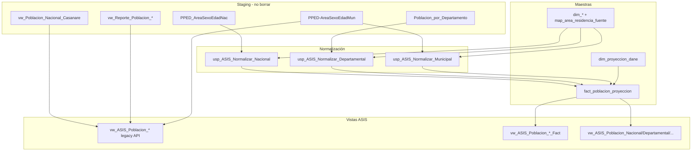

# FASE 0 — Inventario vistas/procedimientos vs tablas maestras

**Base:** `ObservatorioDB_ASIS_Test` únicamente.  
**Objetivo:** Saber qué objetos consumen `dim_*`, `fact_*`, `map_*` frente a staging/legacy, y cómo migrar **en paralelo** (sin borrar fuentes ni vistas actuales) hasta comparar datos.

---

## 1. Tablas maestras (capa normalizada)

| Objeto | Rol |
|--------|-----|
| `dim_departamento`, `dim_municipio` | Catálogo geo (códigos DANE 2/5 dígitos) |
| `dim_sexo`, `dim_area_residencia` | Catálogo demográfico |
| `dim_curso_vida`, `dim_grupo_edad` | Agrupaciones etarias |
| `dim_proyeccion_dane` | Versiones de proyección DANE |
| `map_area_residencia_fuente` | Mapeo texto fuente → `id_area` |
| `fact_poblacion_proyeccion` | Hecho unificado de proyección |
| `fact_defunciones_casanare_normalizada` | Hecho mortalidad (ya normalizada) |

**Fuentes staging (no eliminar):** `PPED_AreaSexoEdadNac_1950_2070`, `Poblacion_por_Departamento`, `PPED-AreaSexoEdadMun-2018-2042_VP`, vistas `vw_Poblacion_Nacional_Casanare`, `vw_Reporte_Poblacion_*`.

---

## 2. Matriz por objeto

### 2.1 Procedimientos de escritura / normalización (100 % maestras)

| Objeto | Lee maestras | Lee staging | Notas |
|--------|--------------|-------------|-------|
| `fn_ASIS_Resolver_IdArea` | `dim_area_residencia`, `map_area_residencia_fuente` | — | |
| `usp_ASIS_CrearProyeccionDANE` | `dim_proyeccion_dane` | — | |
| `usp_ASIS_Normalizar_Poblacion_Nacional` | `dim_sexo`, `dim_proyeccion_dane`, `fact_poblacion_proyeccion` | `PPED_AreaSexoEdadNac_1950_2070` | DELETE+INSERT por `@id_proyeccion_dane` |
| `usp_ASIS_Normalizar_Poblacion_Departamental` | `dim_departamento`, `dim_sexo`, `dim_proyeccion_dane`, `fact_*`, `fn_ASIS_Resolver_IdArea` | `Poblacion_por_Departamento` | |
| `usp_ASIS_Normalizar_Poblacion_Municipal` | `dim_sexo`, `dim_proyeccion_dane`, `fact_*` | `PPED-AreaSexoEdadMun-2018-2042_VP` | Solo DP=85 |
| `usp_ASIS_Normalizar_Poblacion_Todo` | `fact_poblacion_proyeccion` | (vía SPs hijos) | Orquestador |

### 2.2 Catálogos y reportes legacy (mix maestras + staging)

| Objeto | Fuente principal | Usa maestras | Impacto |
|--------|------------------|--------------|---------|
| `usp_Catalogo_Departamentos_Listar` | **`dim_departamento`** | Sí | Admin / filtros |
| `usp_Catalogo_Municipios_Listar` | **`dim_municipio`** | Sí | Admin / filtros |
| `usp_Catalogo_Anios_Listar` | `vw_Poblacion_Nacional_Casanare` vía `ufn_Proyeccion_VistaDefault` | No (staging) | Años disponibles en UI proyección |
| `usp_Catalogo_Areas_Listar` | Vista default (staging) | No | |
| `usp_Catalogo_Sexos_Listar` | Vista default (staging) | No | |
| `usp_Catalogo_Regionales_Listar` | Vista default (staging) | No | |
| `usp_ProyeccionPoblacion_ConsultarPaginado` | Vista default (staging) | No | Módulo proyección legacy |
| `usp_Reporte_Poblacion_CursoVida_Unificado` | PPED directo | `dim_departamento`, `dim_municipio` | Alimenta vista reporte |
| `usp_Reporte_Poblacion_Quinquenios_Unificado` | PPED directo | `dim_departamento`, `dim_municipio` | Alimenta vista reporte |

### 2.3 Vistas ASIS población — estado actual en test

| Vista | Capa actual | Fuente de datos | API backend (`AsisRepository`) |
|-------|-------------|-----------------|--------------------------------|
| `vw_ASIS_Poblacion_Total` | **LEGACY** | `vw_Poblacion_Nacional_Casanare` + `dim_departamento` | `poblacion-total` |
| `vw_ASIS_Poblacion_Municipio` | **LEGACY** | `vw_Poblacion_Nacional_Casanare` + dims geo | `poblacion-municipio` |
| `vw_ASIS_Poblacion_Sexo` | **LEGACY** | idem + `dim_sexo` | `poblacion-sexo` |
| `vw_ASIS_Poblacion_Area` | **LEGACY** | idem + `dim_area_residencia` | `poblacion-area` |
| `vw_ASIS_Poblacion_CursoVida` / `GrupoEdad` | **Restaurado a LEGACY** (script 16) | Legacy usa `vw_Reporte_*`; fact en `*_Fact` | Etiquetas curso de vida difieren (legacy: `1-Primera Infancia…`; fact: `dim_curso_vida`) |
| `vw_ASIS_Piramide_Poblacional` | **LEGACY** | `PPED-AreaSexoEdadMun-2018-2042_VP` + dims | `piramide-poblacional` |
| `vw_ASIS_Poblacion_Nacional` | **FACT** | `fact_poblacion_proyeccion` | (sin ruta API aún) |
| `vw_ASIS_Poblacion_Departamental` | **FACT** | idem | (sin ruta API aún) |
| `vw_ASIS_Poblacion_Municipal` | **FACT** | idem | (sin ruta API aún) |
| `vw_ASIS_Poblacion_Piramide` | **FACT** | idem | (sin ruta API aún) |
| `vw_ASIS_Poblacion_Total_Sexo_Area` | **FACT** | idem | (sin ruta API aún) |

⚠️ El script `14_proyeccion_dane_versionamiento.sql` había **sobrescrito** `GrupoEdad` y `CursoVida` con esquema fact. El script `16` restaura el contrato API y deja fact en vistas `*_Fact`.

### 2.4 Vistas ASIS mortalidad (ya en maestras)

| Vista | Fuente |
|-------|--------|
| `vw_ASIS_Mortalidad_*` (Total, Municipio, Sexo, Area, GrupoEdad, CursoVida) | `fact_defunciones_casanare_normalizada` + `dim_*` |
| `vw_ASIS_Tasa_Bruta_Mortalidad` | Vistas mortalidad + **población legacy** (`vw_ASIS_Poblacion_Total`, `_Municipio`) |
| `vw_ASIS_Serie_Mortalidad` | Mortalidad + **población legacy** |
| `vw_ASIS_Comparativo_Poblacion_Mortalidad` | Población legacy + mortalidad |

---

## 3. Propuesta: capas paralelas sin borrar nada

### Principio

1. **No DROP** de tablas staging, vistas legacy ni vistas fact existentes.
2. Restaurar contrato API en vistas **sin sufijo** (legacy).
3. Publicar equivalentes **fact** con sufijo `_Fact` y forma alineada al API donde aplique.
4. Comparar con script dedicado antes de cambiar `AsisRepository.cs`.

### Naming propuesto

| Rol | Nombre | Origen |
|-----|--------|--------|
| API actual (legacy) | `vw_ASIS_Poblacion_Total` … | `sql-refactor-fase7-asis-03-vistas-poblacion-mortalidad.sql` |
| Respaldo explícito | `vw_ASIS_Poblacion_*_Legacy` | Copia de fase7 (solo donde haya riesgo de sobrescritura) |
| Nueva capa fact | `vw_ASIS_Poblacion_*_Fact` | Agregaciones sobre `fact_poblacion_proyeccion` |
| Exploración detallada | `vw_ASIS_Poblacion_Nacional`, `_Departamental`, … | Ya existen (granularidad distinta al API) |

### Orden de aplicación (solo test)

```text
16_vistas_paralelas_legacy_fact.sql   → crea _Legacy / _Fact, restaura API legacy
15_comparacion_vistas_legacy_vs_fact.sql → solo lectura, reporta diferencias
13_comparacion_detallada_poblacion.sql   → fact vs tablas fuente (ETL)
```

### Cambios futuros (fuera de FASE 0 SQL)

- `AsisRepository.cs`: apuntar a `_Fact` o a vistas sin sufijo cuando comparación sea 0 diff en rango de años Casanare.
- `usp_Catalogo_Anios_Listar`: opción B — UNION años desde `fact_poblacion_proyeccion` filtrado por `@id_proyeccion_dane`.
- Tasas (`vw_ASIS_Tasa_Bruta_Mortalidad`): segunda variante `_Fact` usando `vw_ASIS_Poblacion_Total_Fact`.

---

## 4. Resultados de comparación (ejecutado en test)

### 4.1 ETL: staging → `fact_poblacion_proyeccion`

Script `13_comparacion_detallada_poblacion.sql`:

- Departamental Casanare (85): **OK** año a año (excl. área Total en fuente).
- Municipal Casanare: **OK** totales y drill-down Yopal 2018 edad 0.
- Nacional: **OK** en años con diferencia = 0 filas.

### 4.2 Vistas API legacy vs agregación fact (id_proyeccion_dane = 1)

| Indicador | Resultado |
|-----------|-----------|
| `vw_ASIS_Poblacion_Total` vs fact dept 85 (Urbano+Rural, M+F) | **Coincide** en años solapados (ej. 2018, 2020, 2025) |
| Rango años | Legacy **1985–2042**; fact departamental **2005–2045** → 23 “diferencias” son solo años presentes en una capa y no en la otra |
| `vw_ASIS_Poblacion_Municipio` 2020 | **0 municipios con diferencia** (suma Urbano+Rural × M+F en fact) |
| `vw_ASIS_Poblacion_CursoVida` / `GrupoEdad` | Legacy suma **489 481** vs total dept **441 510** (2020); fact `_Fact` suma **441 510** = total | Etiquetas distintas; legacy sobre-cuenta por JOIN LIKE en dims |

---

## 5. Diagrama de dependencias (población)



---

## 6. Scripts relacionados

| Script | Propósito |
|--------|-----------|
| `scripts/asis-test-clone/13_comparacion_detallada_poblacion.sql` | fact vs tablas fuente |
| `scripts/asis-test-clone/15_comparacion_vistas_legacy_vs_fact.sql` | legacy API vs capa _Fact |
| `scripts/asis-test-clone/16_vistas_paralelas_legacy_fact.sql` | Crea vistas paralelas sin eliminar objetos |

Ejemplo:

```powershell
sqlcmd -S localhost\SQLEXPRESS2025 -d ObservatorioDB_ASIS_Test -E -i scripts\asis-test-clone\15_comparacion_vistas_legacy_vs_fact.sql
```
