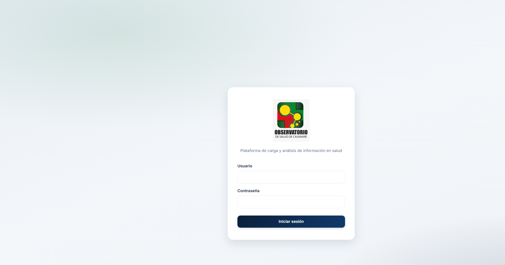
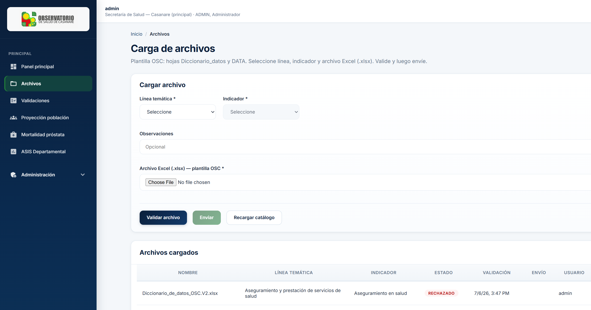
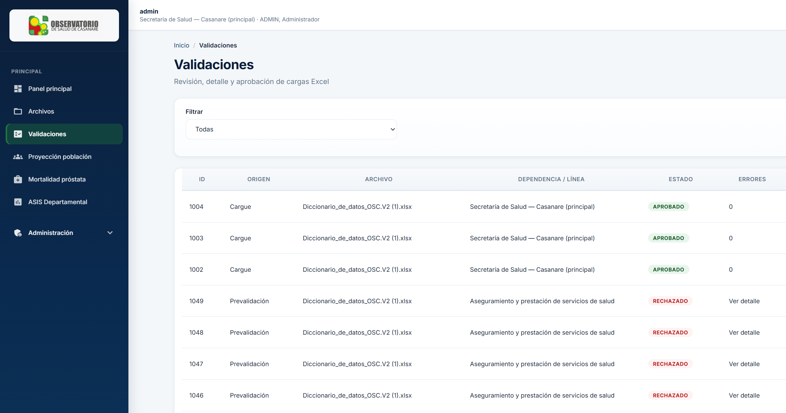
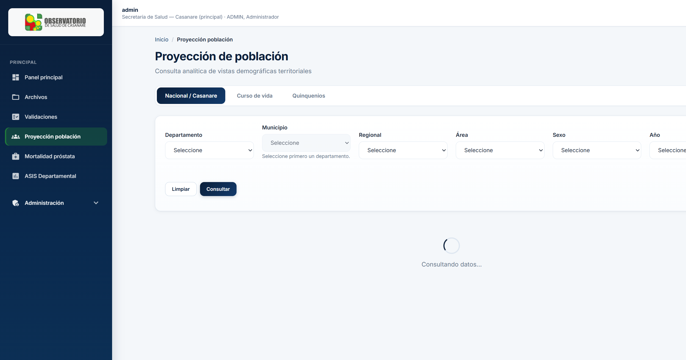
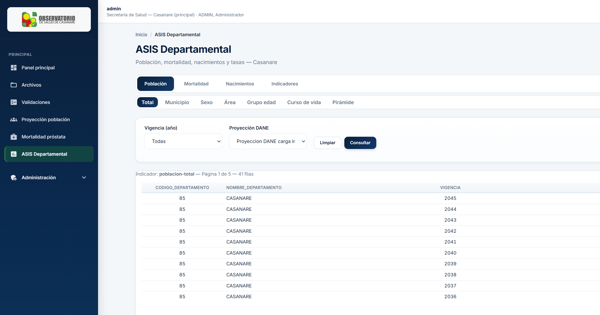
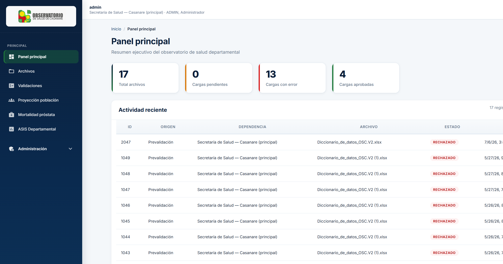

# 02 — Manual de usuario

**Observatorio OSD — Casanare**  
Versión 1.0 — Julio 2026

---

## 1. Acceso al sistema

### 1.1 URL

| Ambiente | Dirección |
|----------|-----------|
| Producción (IIS) | `http://<servidor>:8081/` |
| Desarrollo | `http://localhost:4200/login` |

### 1.2 Inicio de sesión



1. Ingrese su **usuario** o **correo electrónico**.
2. Ingrese su **contraseña**.
3. Pulse **Iniciar sesión**.

> **Nota:** Si aparece el mensaje *"Su sesión expiró"*, vuelva a iniciar sesión. El sistema renueva el token automáticamente mientras trabaja activamente; tras largos periodos de inactividad debe autenticarse de nuevo.

### 1.3 Cierre de sesión

Use el botón **Cerrar sesión** en la barra superior.

---

## 2. Navegación principal

Tras iniciar sesión verá el menú lateral con estos módulos (según su rol):

| Menú | Descripción |
|------|-------------|
| **Panel principal** | Resumen de cargues y actividad |
| **Archivos** | Subir y gestionar archivos Excel |
| **Validaciones** | Aprobar o rechazar cargues (validadores/admin) |
| **Población** | Consulta de proyección de población DANE |
| **Próstata** | Tasa de mortalidad por cáncer de próstata |
| **ASIS** | Indicadores departamentales (población, mortalidad, nacimientos) |
| **Administración** | Solo administradores |

---

## 3. Carga de archivos Excel



### 3.1 Requisitos del archivo

- Formato **.xlsx** (Excel).
- Debe incluir las hojas:
  - **Diccionario_datos** — define columnas, tipos y reglas.
  - **DATA** — datos a cargar.
- Debe corresponder a la **línea temática** e **indicador** seleccionados.

### 3.2 Flujo recomendado

```
1. Seleccionar línea temática e indicador
2. Seleccionar archivo Excel
3. Validar  →  revisar errores si los hay
4. Enviar   →  queda pendiente de aprobación
5. (Validador) Aprobar o Rechazar
```

### 3.3 Paso a paso — Validar

1. Vaya a **Archivos**.
2. Seleccione **Línea temática** e **Indicador**.
3. Elija el archivo con **Seleccionar archivo**.
4. Pulse **Validar**.
5. Revise el resultado:
   - **Sin errores:** puede enviar.
   - **Con errores:** corrija el Excel y vuelva a validar. Consulte el detalle de errores por fila y columna.

### 3.4 Paso a paso — Enviar

1. Tras validación exitosa, pulse **Enviar**.
2. El archivo pasa a estado pendiente de aprobación.
3. Aparecerá en **Validaciones** para el validador.

### 3.5 Acciones sobre archivos cargados

| Acción | Icono | Descripción |
|--------|-------|-------------|
| Ver detalle | Ojo | Metadatos y estado |
| Descargar | Descarga | Obtener el .xlsx original |
| Eliminar | Papelera | Quitar archivo (según permisos) |

---

## 4. Validaciones (validadores y administradores)



### 4.1 Cola de pendientes

En **Validaciones** verá los cargues en espera de revisión institucional.

### 4.2 Aprobar un cargue

1. Abra el detalle del cargue.
2. Revise datos y errores previos (si aplica).
3. Pulse **Aprobar**.
4. Confirme en el cuadro de diálogo del sistema.

### 4.3 Rechazar un cargue

1. Abra el detalle.
2. Pulse **Rechazar**.
3. Indique **observaciones** (motivo del rechazo).
4. Confirme.

El responsable de la dependencia podrá corregir el archivo y volver a cargar.

---

## 5. Consulta de población



### 5.1 Filtros disponibles

| Filtro | Descripción |
|--------|-------------|
| Departamento | Por defecto Casanare (85) |
| Municipio | Código DANE de 5 dígitos |
| Regional | Zona de salud |
| Área | Urbana / rural |
| Sexo | Hombre / mujer |
| Año | Vigencia de la proyección |

### 5.2 Tipos de consulta

- Población nacional Casanare
- Por curso de vida
- Por quinquenios de edad

### 5.3 Descargar resultados

Use **Descargar Excel** para exportar la consulta actual con los filtros aplicados.

---

## 6. Módulo ASIS departamental



El módulo **ASIS** consolida información para el Análisis de Situación de Salud departamental.

### 6.1 Grupos de indicadores

| Grupo | Contenido |
|-------|-----------|
| **Población** | Total, municipio, sexo, área, grupo edad, curso de vida, pirámide |
| **Mortalidad** | Total, municipio, detalle, sexo, área, grupo edad, curso de vida |
| **Nacimientos** | Total, municipio, sexo, área, edad madre, educación, etnia, peso, gestación |
| **Indicadores** | Tasa bruta mortalidad, serie histórica, comparativo población-mortalidad |

### 6.2 Filtros

- **Vigencia (año):** seleccione el año a consultar.
- **Municipio:** código DANE (ej. `85015` para Aguazul).
- **Proyección DANE:** cuando aplique en consultas de población.

### 6.3 Exportar Excel ASIS

En grupos de **Nacimientos** y **Mortalidad**, use **Descargar nacimientos (Excel)** o **Descargar defunciones (Excel)** para obtener plantillas en formato DANE.

---

## 7. Indicador próstata

Muestra tasas de mortalidad por cáncer de próstata desde la vista validada institucionalmente. Permite filtrar por territorio, año y área.

---

## 8. Panel principal (dashboard)



Muestra:

- Total de archivos cargados
- Cargues pendientes, con error y aprobados
- Actividad reciente (últimos cargues)

Los números se filtran según su rol: operadores ven su dependencia; validadores y administradores ven el consolidado.

---

## 9. Errores frecuentes

| Mensaje | Causa probable | Qué hacer |
|---------|----------------|-----------|
| Sesión expiró | Token vencido tras inactividad | Volver a iniciar sesión |
| Credenciales inválidas | Usuario o contraseña incorrectos | Verificar datos; contactar admin |
| Hoja Diccionario_datos no encontrada | Excel incompleto | Usar plantilla oficial OSC |
| Error geográfico en fila X | Municipio/departamento no válido | Verificar códigos DANE en catálogo |
| Indicador ASIS no encontrado | Clave de consulta incorrecta | Recargar página; contactar soporte |
| Error de conexión | API no disponible | Verificar que el servicio esté activo |

---

## 10. Glosario

| Término | Significado |
|---------|-------------|
| **OSC** | Observatorio de Salud de Casanare |
| **ASIS** | Análisis de Situación de Salud |
| **DANE** | Departamento Administrativo Nacional de Estadística |
| **DIVIPOLA / código DANE** | Código territorial oficial (departamento 2 dígitos, municipio 5) |
| **Línea temática** | Eje del observatorio (ej. aseguramiento, ECNT) |
| **Indicador** | Variable específica dentro de una línea |
| **Vigencia** | Año de referencia de los datos |
| **Validador** | Usuario autorizado para aprobar cargues |

---

## 11. Soporte

Ante incidencias operativas, reporte:

1. Pantalla donde ocurrió el error.
2. Usuario con el que ingresó.
3. Hora aproximada.
4. Captura de pantalla del mensaje.
5. Archivo Excel (si aplica al cargue).

Contacto de soporte: _completar en acta de entrega_.

---

*Manual orientado a operadores y validadores de la Secretaría de Salud de Casanare.*
