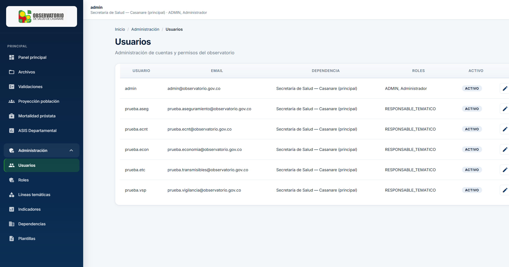

# 03 — Manual de administrador

**Observatorio OSD — Casanare**  
Versión 1.0 — Julio 2026

---

## 1. Perfil administrador

El rol **ADMIN** (o **Administrador**) tiene acceso al menú **Administración** y a todas las funciones operativas del sistema.

**Rutas Angular:**

| Sección | URL |
|---------|-----|
| Usuarios | `/administracion/usuarios` |
| Nuevo usuario | `/administracion/usuarios/nuevo` |
| Editar usuario | `/administracion/usuarios/{id}` |
| Roles | `/administracion/roles` |
| Líneas temáticas | `/administracion/lineas-tematicas` |
| Indicadores | `/administracion/indicadores` |
| Dependencias | `/administracion/dependencias` |
| Plantillas | `/administracion/plantillas` |
| Campos de plantilla | `/administracion/plantillas/{id}/campos` |

---

## 2. Gestión de usuarios



### 2.1 Crear usuario

1. **Administración → Usuarios → Nuevo**.
2. Complete:
   - Nombre de usuario (único)
   - Correo electrónico
   - Contraseña inicial
   - Dependencia (opcional según rol)
   - Línea temática (si aplica)
   - Roles
3. Guarde.

### 2.2 Editar usuario

- Modifique correo, dependencia, línea temática o contraseña.
- Los cambios de roles se hacen en la misma pantalla o en la acción **Asignar roles**.

### 2.3 Activar / inactivar

Use el interruptor o acción **Activar/Inactivar**. Un usuario inactivo no puede iniciar sesión.

### 2.4 Roles disponibles

| Rol | Uso típico |
|-----|------------|
| `ADMIN` | Administración total |
| `VALIDADOR` | Aprobación de cargues |
| `COORDINADOR_DEPENDENCIA` | Carga por dependencia |
| `RESPONSABLE_TEMATICO` | Carga por línea/área asignada |
| `CONSULTA` | Solo lectura |
| `AUDITOR` | Consulta de auditoría |

> **Seguridad:** Cambie la contraseña del usuario `admin` inicial en producción. No use `Admin123*` en entornos reales.

---

## 3. Gestión de dependencias

Las **dependencias** representan entidades que cargan información (secretarías, direcciones, etc.).

| Campo | Descripción |
|-------|-------------|
| Código | Identificador corto (ej. `CAS-SALUD`) |
| Nombre | Nombre institucional |

**API:** `GET/POST /api/admin/dependencias`

---

## 4. Líneas temáticas e indicadores

### 4.1 Líneas temáticas

Agrupan los indicadores del observatorio (ASEG, ECNT, VSP, ETC, ECON, etc.).

| Campo | Descripción |
|-------|-------------|
| Código | Identificador (ej. `aseg`) |
| Nombre | Nombre descriptivo |
| Activo | Si aparece en cargues |

### 4.2 Indicadores

Cada indicador pertenece a una línea temática y define qué archivo se espera cargar.

| Campo | Descripción |
|-------|-------------|
| Línea temática | Padre |
| Código / nombre | Identificación |
| Descripción | Texto de ayuda |

### 4.3 Importación desde Excel

`POST /api/admin/areas-tematicas/importar-excel` permite sembrar áreas desde el archivo oficial en `data/` si está disponible en el servidor.

---

## 5. Plantillas de carga

Las plantillas definen la estructura esperada de campos para validación.

### 5.1 Crear plantilla

1. **Administración → Plantillas → Nueva**.
2. Asocie a línea temática / indicador si aplica.
3. Defina nombre y versión.

### 5.2 Campos de plantilla

En **Plantillas → Campos** configure por cada campo:

- Nombre del campo
- Tipo de dato
- Obligatorio (sí/no)
- Longitud, formato, valores permitidos

Esto complementa la validación del diccionario embebido en el Excel OSC.

---

## 6. Roles (CRUD)

En **Administración → Roles** puede:

- Listar roles del sistema
- Crear roles personalizados (si la política institucional lo permite)
- Editar descripción
- Eliminar roles no asignados

> Los roles `ADMIN` y `VALIDADOR` son críticos para el flujo de aprobación; no eliminar sin reasignar usuarios.

---

## 7. Auditoría

**Ruta API:** `GET /api/auditoria`  
**Acceso:** ADMIN o AUDITOR

Registra acciones administrativas: creación/edición de usuarios, cambios de configuración, etc.

---

## 8. Validaciones administrativas

Como administrador puede:

- Ver **todos** los archivos y cargues (cualquier dependencia).
- **Aprobar** y **rechazar** cargues (igual que validador).
- Acceder al dashboard administrativo: `GET /api/admin/dashboard`

---

## 9. Configuración de líneas de prueba

En desarrollo, la API puede crear usuarios de prueba por línea temática al arrancar (`prueba.aseg`, `prueba.ecnt`, etc.). En producción use:

```json
"Observatorio": {
  "SkipSchemaBootstrap": true,
  "SkipStartupSeeds": true
}
```

---

## 10. Buenas prácticas

1. **Principio de mínimo privilegio:** asigne solo los roles necesarios.
2. **Contraseñas:** política institucional de complejidad y rotación.
3. **Usuarios de servicio:** evite compartir cuenta admin; cree cuentas nominales.
4. **Inactivar** en lugar de eliminar usuarios que salen de la institución.
5. **Respaldo** de `ObservatorioDB` antes de cambios masivos en catálogos.

---

## 11. Tareas periódicas sugeridas

| Frecuencia | Tarea |
|------------|-------|
| Mensual | Revisar usuarios activos y roles |
| Trimestral | Validar catálogos DANE (municipios nuevos) |
| Por cierre ASIS | Verificar vigencias y fuentes en módulo ASIS |
| Ante actualización DANE | Ejecutar scripts de población según manual técnico |

---

## 12. Referencias técnicas

- API administración: [07-API-ENDPOINTS.md](07-API-ENDPOINTS.md) (sección Admin)
- Seguridad y roles: [08-SEGURIDAD.md](08-SEGURIDAD.md)
- Operación y backups: [10-OPERACION-Y-SOPORTE.md](10-OPERACION-Y-SOPORTE.md)

---

*Manual para administradores del Observatorio OSD — Secretaría de Salud de Casanare.*
