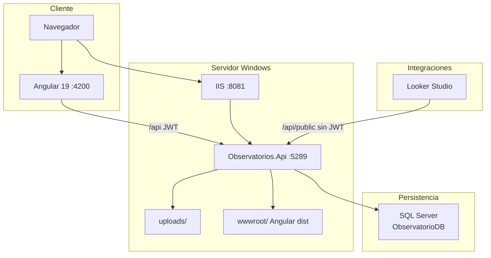

# 05 — Arquitectura del sistema

**Observatorio OSD — Casanare**  
Versión 1.0 — Julio 2026 (actualizada)

---

## 1. Descripción general

Monolito hospedado: una aplicación **ASP.NET Core** sirve la **API REST** y el **frontend estático** (Angular compilado en `wwwroot`), con persistencia en **SQL Server** y archivos en disco (`uploads/`).

| Capa | Tecnología |
|------|------------|
| Presentación | Angular 19 (principal), HTML legacy en `public/` (deprecado) |
| API | ASP.NET Core minimal API |
| Datos | SQL Server — vistas `vw_*` y procedimientos `usp_*` |
| Archivos | Sistema de archivos — `uploads/*.xlsx` |
| Seguridad | JWT Bearer + BCrypt |

---

## 2. Diagrama de arquitectura



---

## 3. Frontend Angular

### 3.1 Estructura

```
frontend/src/app/
├── core/           # Auth, guards, interceptors, servicios globales
├── layout/         # Main layout, sidebar, header
├── modules/        # Feature modules (archivos, asis, admin, …)
├── shared/         # Componentes y modelos compartidos
└── login/
```

### 3.2 Rutas principales

| Ruta | Módulo |
|------|--------|
| `/login` | Autenticación |
| `/dashboard` | Panel principal |
| `/archivos` | Cargue Excel |
| `/validaciones` | Aprobación |
| `/poblacion` | Proyección población |
| `/prostata` | Indicador próstata |
| `/asis` | ASIS departamental |
| `/administracion/*` | Solo ADMIN |

### 3.3 Interceptores HTTP

| Interceptor | Función |
|-------------|---------|
| `authInterceptor` | Agrega `Authorization: Bearer {token}` |
| `apiErrorInterceptor` | Renueva token ante 401; cierra sesión si falla |

### 3.4 Sesión

`SessionKeepAliveService` renueva el JWT automáticamente mientras el usuario está activo (ver [08-SEGURIDAD.md](08-SEGURIDAD.md)).

---

## 4. Backend

### 4.1 Organización

| Carpeta | Responsabilidad |
|---------|-----------------|
| `Endpoints/` | Definición de rutas (`ApiEndpoints`, `AdminEndpoints`, `AsisEndpoints`) |
| `Data/` | Repositorios — invocan `usp_*` |
| `Services/` | Validación Excel, auth, cargas, exportación ASIS |
| `Auth/` | JWT, `UserContext`, políticas |
| `Models/` | DTOs y constantes de roles |

### 4.2 Regla arquitectónica SQL

- **Lecturas:** vistas `vw_*` o `usp_*` con parámetros.
- **Escrituras:** siempre `usp_*` (incluye TVP para cargas masivas).
- **Sin SQL inline** duplicado en C# para operaciones de negocio.

### 4.3 Servicios clave

| Servicio | Función |
|----------|---------|
| `AuthService` | Login, generación y renovación JWT |
| `OscPlantillaValidacionService` | Validación Excel OSC V.2 |
| `CargaArchivoService` | Flujo de cargue |
| `ArchivoFlujoService` | Validar / enviar archivos |
| `AsisExcelExportService` | Exportación Excel formato DANE |
| `CatalogoService` | Catálogos geográficos y demográficos |

---

## 5. Base de datos

Ver [06-BASE-DE-DATOS.md](06-BASE-DE-DATOS.md).

**Bases:**

- `ObservatorioDB` — producción.
- `ObservatorioDB_ASIS_Test` — laboratorio normalización ASIS.

---

## 6. Flujos principales

### 6.1 Autenticación

```
POST /api/auth/login → JWT + datos usuario
     ↓
Peticiones con Bearer token
     ↓
POST /api/auth/refresh (renovación automática)
```

### 6.2 Cargue Excel

```
Seleccionar línea + indicador + archivo
     ↓
POST /api/archivos/validar  →  OscPlantillaValidacionService
     ↓
POST /api/archivos/enviar   →  usp_Carga_* + uploads/
     ↓
POST /api/cargas/{id}/aprobar  (validador)
```

### 6.3 Consulta ASIS

```
GET /api/asis/indicadores/{clave}?vigencia=&codigoMunicipio=
     ↓
AsisRepository → vw_ASIS_* (paginado)
```

---

## 7. Despliegue

| Modo | Puertos |
|------|---------|
| Dev API | 5289 |
| Dev Angular | 4200 (proxy → 5289) |
| IIS producción | 8081 (API + estáticos mismo origen) |

Script: `scripts/publicar-iis.ps1` → `C:\Hosting\ObservatorioOSD`

---

## 8. Tecnologías y dependencias

### Backend (NuGet principales)

- `Microsoft.Data.SqlClient`
- `Microsoft.AspNetCore.Authentication.JwtBearer`
- `BCrypt.Net-Next`
- `ClosedXML`

### Frontend (npm principales)

- `@angular/*` 19.x
- `@angular/material`
- `rxjs`

---

## 9. Configuración por ambiente

| Parámetro | Desarrollo | Producción |
|-----------|------------|------------|
| `SkipSchemaBootstrap` | false | true |
| `SkipStartupSeeds` | false | true |
| `Asis.CapaPoblacion` | `fact` (si ASIS Test) | `legacy` |
| BD | LocalDB o SQLEXPRESS | SQLEXPRESS / institucional |
| Swagger | Habilitado | Habilitado (restringir en prod si se desea) |

---

## 10. Integraciones externas

| Integración | Mecanismo |
|-------------|-----------|
| Looker Studio | `GET /api/public/indicadores/prostata` (sin JWT) |
| Google Sheets | Mismo endpoint vía Apps Script |
| Exportación Excel | Endpoints `/excel` en población y ASIS |

---

## 11. Evolución y deuda técnica

| Tema | Estado |
|------|--------|
| Frontend Angular | Principal — `public/` en deprecación |
| Capa `fact` población en prod | Pendiente migración desde ASIS Test |
| Notificaciones email | No implementado |
| Documento ASIS Word/PDF | No implementado |

---

*Documento de arquitectura — complementa [docs/ARQUITECTURA.md](../ARQUITECTURA.md) con estado actual Jul 2026.*
